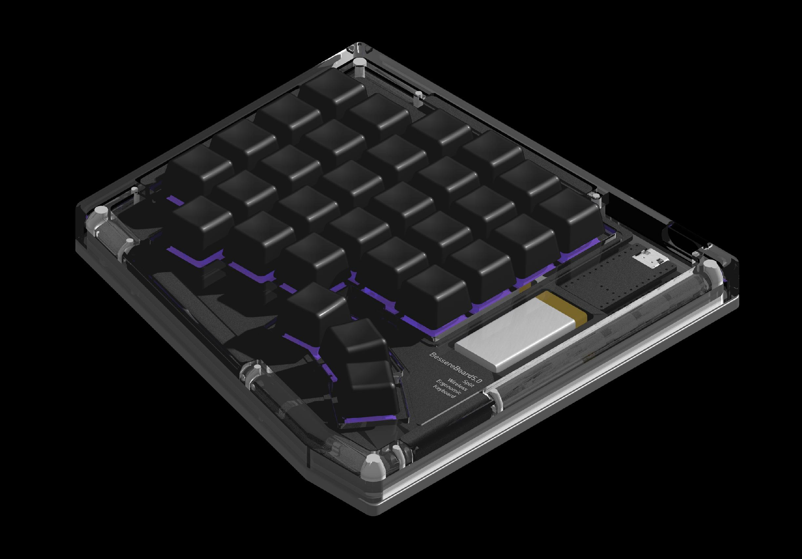

# Split Ergonomic Wireless Gasket-Mounted Keyboard

  

## Features

- **Ergonomic split design** — reduces wrist strain and promotes a more neutral typing position
- **Ortholinear layout**     — aligns keys in a grid, reducing finger travel distance with 3 dedicated thumb buttons
- **Gasket-mounted PCB**     — provides a dampened sound profile and soft keystroke feel
- **Magnetic closure**       — enables quick assembly and disassembly without tools
- **Reversible PCB design**  — single PCB works for both left and right halves
- **Hot-swappable switches** — easily swap or customize switches without soldering
- **ZMK firmware support**   — fully customizable keymap via ZMK Studio
- **Wireless connectivity**  — powered by the nice!nano v2.0 microcontroller

---

## Case

All case parts are CNC machined, and material selection significantly impacts the sound profile. The rigid aluminum base dampens resonance while the polycarbonate top provides acoustic transparency, and rounded internal surfaces minimize harsh reflections for a refined keystroke sound. STL files are included for 3D-printed case variants.

| Part | Material | Surface Finish |
|------|----------|----------------|
| Top casing | Polycarbonate (PC) | Blue-tinted vapor polishing |
| Bottom casing | Aluminum 6061 | Bead blasting + anodizing |

---

## Parts List (Bill of Materials)

Quantities are **per half** — a complete keyboard requires two of everything below.

| Qty | Component | Specification |
|-----|-----------|---------------|
| 8 | Corner magnet | Neodymium disc, ⌀4 × 3 mm |
| 16 | Edge magnet | Neodymium disc, ⌀2 × 3 mm |
| 6 | Large gasket foam | Poron, 4.5 × 7 × 2 mm |
| 2 | Small gasket foam | Poron, 4.5 × 4 × 2 mm |
| 4 | Rubber foot | ⌀8 × 1.6 mm |
| 1 | Microcontroller | nice!nano v2.0 |
| 1 | Battery | 3.7 V LiPo, 250 mAh, model 502030, 2P-PH connector |
| 1 | Battery connector | S2B-PH-K-S(LF)(SN) |
| 1 | Power switch | MSK12C02 (SMD slide switch) |
| 30 | Keyswitch | MX-format (any compatible switch) |
| 30 | Hotswap socket | Kailh MX-format |
| 30 | Diode | 1N4148W, SOD-123 |

### Part Notes

Only the parts below have constraints or behavior worth calling out; everything else fits as listed.

- **Magnets** — Cutouts are intentionally oversized to ensure a proper fit during assembly. Corner cutouts are ⌀4.1 mm × 3 mm deep; edge cutouts are ⌀2.1 mm × 3 mm deep.
- **Rubber feet** — Seat into ⌀8 mm × 1.5 mm-deep cutouts and must protrude a minimum of 0.1 mm below the case bottom for optimal grip.
- **Battery** — The cutout on the top plate is shared with the battery connector jack, which limits usable space. Optimal dimensions are **50 mm (H) × 20 mm (W) × 30 mm (D)**. ⚠️ Taller batteries are possible, but wider or longer batteries are not recommended and may not fit reliably.

---

## PCB Specifications

- **Layer count:** 2-layer
- **Material:** FR-4, 1.6 mm thickness
- **Copper weight:** 1 oz
- **Surface finish:** LeadFree HASL

**Design note:** The PCB switchplate (`SkofTopPlate.kicad_pcb`) is 1.6 mm FR-4 (standard manufacturing thickness), while standard MX switches are designed for 1.5 mm plates. Because of this 0.1 mm difference, switches fit securely but may feel slightly tight.

---

## Keymap

The default keymap is currently a placeholder and varies by region. To customize it, press the **`studio_unlock`** key on the left half — at **column 1, row 2** — to enter configuration mode in ZMK Studio.

---

## Preliminary Assembly Guide

1. **Attach Feet** - attach the rubber feet to the bottom casing.
2. **Glue in the magnets** — corner and edge magnets into their cutouts (see Part Notes for fit).
3. **Populate the PCB** — solder diodes, hotswap sockets, the power switch, the battery connector, and the microcontroller sockets.
4. **Mount the electronics** — seat the nice!nano v2.0 and connect the battery.
5. **Add foam** — place gasket foam strips on the Switchplate.
6. **Install switches** — drop MX switches into the hotswap sockets through the plate.
7. **Flash firmware** — load the firmware and verify connectivity.
8. **Close the case** — join the top and bottom halves via the magnetic closure.

---

## Credits

This project uses open-source hardware footprints licensed under MIT and CC-BY-NC-SA 4.0 by Marco Massarelli (@ceoloide) and contributors.